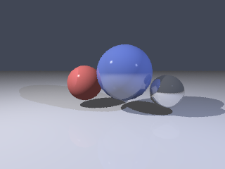

# Ray Tracer

A 3D ray tracer built from scratch in pure Python. No numpy, no Pillow,
no third-party dependencies of any kind - vector math, ray/sphere and
ray/plane intersection, Phong shading, hard shadows, recursive
reflections, jittered-sample anti-aliasing, and even the PNG encoder
are all implemented from first principles using only the standard
library.



## Why

Ray tracing is a good stress test for "from scratch" software: it
touches linear algebra, numerical geometry, recursion, and a binary
file format (PNG), and the correctness of each piece is directly
visible in the output image - a bug in the shadow test or the
reflection formula shows up immediately as a visual artifact. This
project builds the whole pipeline as a small, readable Python package
rather than wrapping an existing renderer.

## What it does

- **Vector math** (`raytracer/vec3.py`): a `Vec3` class for points,
  directions and RGB colors, with dot/cross products, normalization,
  reflection, and gamma-corrected byte conversion.
- **Geometry** (`raytracer/shapes.py`): analytic ray/sphere
  intersection (quadratic formula) and ray/plane intersection, each
  returning the nearest positive `t` along the ray.
- **Camera** (`raytracer/scene.py`): a pinhole camera defined by
  position, look-at target, up vector and vertical field of view,
  which generates a primary ray for each normalized screen coordinate.
- **Shading** (`raytracer/render.py`): Phong illumination (ambient +
  diffuse + specular) evaluated per light, hard shadows via a second
  intersection test toward each light, and recursive specular
  reflection up to a fixed depth for mirror-like materials.
- **Anti-aliasing**: multiple jittered samples per pixel are averaged
  to soften jagged edges, controlled by `--samples`.
- **PNG encoder** (`raytracer/image_writer.py`): writes an 8-bit RGB
  PNG directly - PNG signature, `IHDR`/`IDAT`/`IEND` chunks with CRC32
  framing, and `zlib.compress` for the DEFLATE stream - without a
  Pillow-style imaging library.

## How to run

Requires Python 3.8+. No installation step is needed since there are
no runtime dependencies.

```bash
# Render the built-in demo scene (three spheres + floor, two lights)
python main.py --width 640 --height 480 --samples 4 --out render.png
```

Options:

| Flag         | Default      | Meaning                              |
|--------------|--------------|---------------------------------------|
| `--width`    | `480`        | output image width in pixels          |
| `--height`   | `360`        | output image height in pixels         |
| `--samples`  | `4`          | samples per pixel (anti-aliasing)     |
| `--out`      | `render.png` | output PNG path                       |
| `--seed`     | `1`          | RNG seed for jittered sampling        |

Rendering is pure Python (no vectorized math), so a 640x480 image at
4 samples/pixel takes on the order of tens of seconds on a laptop -
that trade-off was made deliberately to keep every line of the math
readable rather than optimizing for speed.

### Running the tests

```bash
python -m unittest discover -s tests -v
# or, if you have pytest installed:
pytest tests/
```

The suite (23 tests) covers vector algebra, sphere/plane intersection
edge cases (hits, misses, rays pointing away from a sphere), camera
ray generation, shadow detection, closest-hit selection when multiple
objects overlap in screen space, and PNG structural validity.

## Design decisions

- **Analytic intersection over sampling.** Sphere and plane hits are
  solved in closed form (quadratic formula for spheres, plane-normal
  dot product for planes) rather than approximated, so intersection
  tests are exact and fast to reason about in tests.
- **Recursion depth capped at 4** for reflections
  (`MAX_REFLECTION_DEPTH` in `render.py`) to bound render time on
  scenes with facing mirrors, at the cost of slightly truncating
  infinite hall-of-mirrors reflections - visually indistinguishable
  past a couple of bounces for this scene's lighting.
- **Shadow bias** (`SHADOW_BIAS = 1e-4`): shadow and reflection rays
  are nudged along the surface normal before re-testing intersections,
  to avoid "shadow acne" from a ray immediately re-intersecting the
  surface it just left due to floating point error.
- **Gamma correction on output** (`Vec3.to_bytes`): linear light
  values are raised to the power `1/2.2` before quantizing to 0-255,
  which is what keeps mid-tones from looking too dark on a standard
  display.
- **No external dependencies, including for the PNG output.** Writing
  the encoder by hand (chunk framing + CRC32 + zlib DEFLATE) keeps the
  entire pipeline, from camera ray to file on disk, auditable in this
  repository rather than delegated to an imaging library.

## Project structure

```
raytracer/
  vec3.py          3D vector / color math
  shapes.py        Sphere, Plane, Material
  scene.py         Light, Camera, Scene, demo_scene()
  render.py        intersection, shading, shadows, reflections, AA
  image_writer.py  dependency-free PNG encoder
main.py            CLI entry point
tests/
  test_raytracer.py
docs/
  sample_render.png
```
